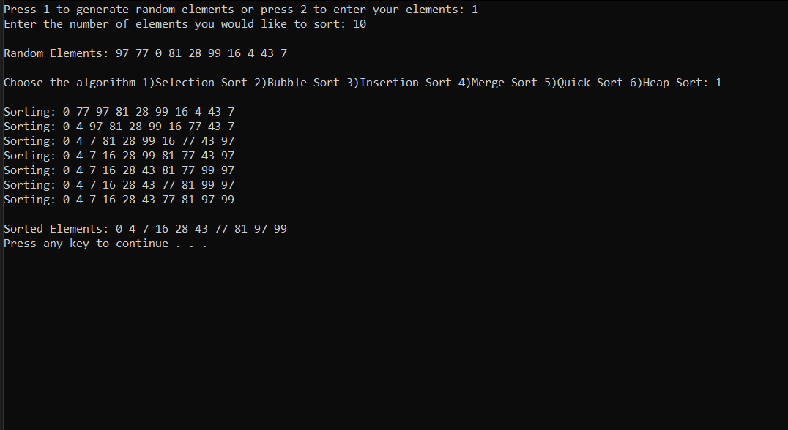

# Sorting Visualizer CLI

> This is a simple command line interface for visualizing sorting algorithms

## Implemented

1. Selection Sort
1. Bubble Sort
1. Insertion Sort
1. Merge Sort
1. Quick Sort
1. Heap Sort

## Prerequisites

### mingw gcc compiler installed to compile c++

## Quick Start

```bash
# Clone the repository
git clone https://github.com/KavishShah09/Sovi-cli.git
```

> ## Run Commands

```bash
g++ Main.cpp -o sovi-cli
```

```
./sovi-cli.exe
```

<p align="center">
 
</p>

### Author [Kavish Shah](http://www.linkedin.com/in/kavish-shah-501b32192)
